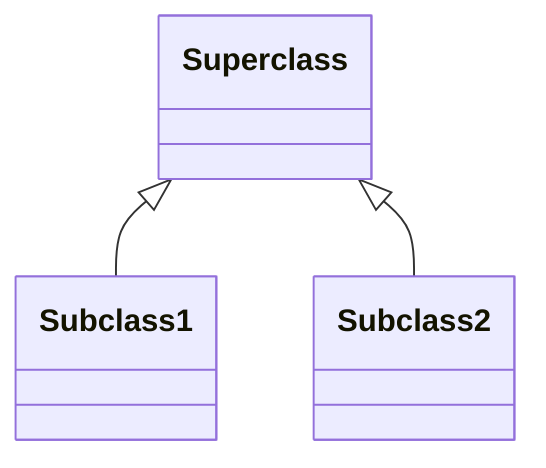

#sample UML Diagram for CS102 by Monique Barrops<br>
#monibarri@uat.edu

Create a Diagram with 2 classes. Those classes need 3 attributes, 3 methods

```mermaid
    classDiagram    
    Class Shape{
        -length
        -width
        -height
        +getLength()
        +setLength()
        +getWidth()
        +setWidth()
    }

    class ShapeSig{
        -length : int
        -width : int
        +getLength() : int
        +setLength(n : int) : void
        +getWidth() : int
        +setWidth(n : int) : void
    }
```
Attributes come before properties or methods<br>
\+ public, \- private, \# protected<br>

