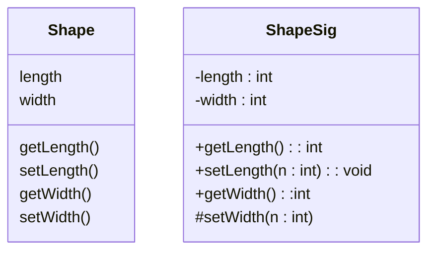
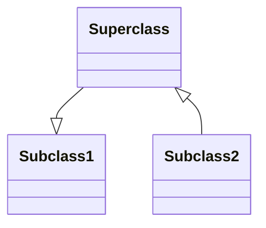

#sample UML diagram for CS102 by Monique Barrios  
#monbarri@uat.edu

Create a diagram with 2 classes. Those classes need 3 attributes, 3 methods

Attributes come before properties or methods 
\+ public, \- private, \# protected
